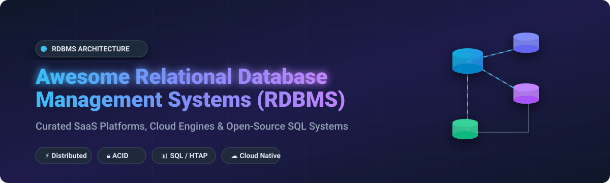

  

# 🗄️ Awesome Relational Database Management System (RDBMS)

> 🚀 **Curated List of Commercial Enterprise SaaS Products, Cloud-Managed Database Engines, & High-Performance Open-Source RDBMS Platforms.**
>
> 📌 *Comprehensive guide to SQL databases, distributed transaction engines, embedded SQL storage, and cloud-native relational infrastructure.*

---

## 💡 Overview & Ecosystem Insights

Relational Database Management Systems (RDBMS) form the foundational backbone of modern enterprise software, mission-critical financial applications, e-commerce, and high-concurrency web services. By enforcing **ACID properties (Atomicity, Consistency, Isolation, Durability)** and offering expressive **SQL querying**, relational engines guarantee data integrity at scale.

### 📊 Market Size & Industry Concentration

- **📈 Estimated Global Market Size:** The global RDBMS and Database Management System (DBMS) market is estimated at **$80+ Billion** (projected to exceed **$120+ Billion** by 2030), driven by rapid cloud migration, serverless database adoption, and real-time AI vector retrieval.
- **🏗️ Market Structure & Fragmentation:** The enterprise SaaS and cloud database sector is **highly concentrated** around major hyper-scalers and legacy tech giants (*Microsoft, Amazon Web Services, Oracle, Google Cloud, and IBM*). However, the developer-focused and open-source distributed SQL landscape remains **moderately fragmented**, with innovative engines like *CockroachDB, TiDB, YugabyteDB, Supabase, and DuckDB* challenging traditional monolithic architectures.

---

## 📚 Table of Contents

- [🏢 SaaS & Hosted Commercial Platforms](#-saas--hosted-commercial-platforms)
- [🔓 Open-Source GitHub Repositories](#-open-source-github-repositories)
- [🤝 How to Contribute](#-how-to-contribute)
- [💖 Support & Sponsorship](#-support--sponsorship)
- [⚠️ Enterprise Security & Disclaimer](#%EF%B8%8F-enterprise-security--disclaimer)
- [⭐ Star History](#-star-history)

---

## 🏢 SaaS & Hosted Commercial Platforms

Below is a curated comparison of leading commercial RDBMS engines and fully managed cloud database platforms, sorted by **company market valuation / revenue** (descending).

| Platform / Vendor | Description & Key Strengths | Starting Pricing (Specific) | Free Tier / Trial Limits | Company Valuation / Revenue |
| :--- | :--- | :--- | :--- | :--- |
| 🔷 **[Microsoft SQL Server](https://www.microsoft.com/en-us/sql-server/)** | Enterprise RDBMS standard with T-SQL, Azure SQL integration, & AI-assisted optimization. | **$3,945** (Standard 2-core pack) or **$0.10/hr** (Azure Arc PAYG). | **Express Edition:** Free up to 10 GB DB size, 1 CPU socket / 4 cores, 1 GB RAM. **Azure SQL:** 100k vCore-sec/mo free. | **$3.3+ Trillion Valuation** / ~$331B Revenue |
| ☁️ **[Google Cloud SQL](https://cloud.google.com/sql)** | Fully managed PostgreSQL, MySQL, & SQL Server database engine on Google Cloud Infrastructure. | **~$8.00/month** (shared-core `db-f1-micro` instance). | **No permanent free tier.** $300 free credits upon sign-up + 30-day Enterprise trial. | **$2.3+ Trillion Valuation** / ~$330B Revenue |
| 📦 **[Amazon Aurora](https://aws.amazon.com/rds/aurora/)** | High-performance MySQL/PostgreSQL-compatible cloud RDBMS auto-scaling up to 128 TB per instance. | **~$0.041/hour** (db.t4g.medium instance) + $0.10/GB-mo storage. | **RDS Free Tier:** 750 hrs/mo Single-AZ db.t2.micro/db.t3.micro for 12 months + $100–$200 free AWS credits. | **$1.9+ Trillion Valuation** / ~$600B Revenue |
| 🔴 **[Oracle Database](https://www.oracle.com/database/)** | Enterprise RDBMS leader for mission-critical OLTP with Real Application Clusters (RAC) & Autonomous AI DB. | **~$47,500** per processor license (Enterprise Edition) or OCI PAYG. | **Always Free:** 2 Autonomous Databases (20 GB storage each). **Developer Free:** 2 vCPUs, 2 GB RAM, 12 GB data. | **$450+ Billion Valuation** / ~$53B Revenue |
| 💼 **[IBM Db2](https://www.ibm.com/products/db2)** | Enterprise AI-powered hybrid database platform optimized for mainframes and enterprise workloads. | **~$1,000** per VPC/month (Db2 Standard Edition). | **Community Edition:** Free forever (limited to 4 vCPU cores & 16 GB RAM for dev/prod). | **$210+ Billion Valuation** / ~$62B Revenue |
| 📐 **[SAP ASE](https://www.sap.com/products/sybase-ase.html)** | Adaptive Server Enterprise high-throughput transaction processing engine for financial services. | **~$11,000/month** (Enterprise core licensing benchmark). | **90-Day Advanced Free Trial** with full transactional capabilities. | **$200+ Billion Valuation** / ~$34B Revenue |

---

## 🔓 Open-Source GitHub Repositories

Top open-source relational databases, distributed SQL engines, embedded storage engines, and PostgreSQL/MySQL extensions, sorted by **GitHub Star Count** (descending).

- ⚡ **[Supabase](https://github.com/supabase/supabase)**  
    
  *The open-source Firebase alternative.* Built on top of PostgreSQL, providing real-time database subscriptions, auto-generated REST/GraphQL APIs, vector search (`pgvector`), authentication, and edge functions.

- 📈 **[ClickHouse](https://github.com/ClickHouse/ClickHouse)**  
    
  *Fast open-source column-oriented database management system.* Engineered for real-time analytical queries (OLAP) on petabyte-scale structured data using SQL.

- 🐬 **[TiDB](https://github.com/pingcap/tidb)**  
    
  *Open-source distributed Hybrid Transactional and Analytical Processing (HTAP) database.* Fully MySQL protocol-compatible, supporting horizontal scaling, strong consistency, and real-time analytics.

- 🦆 **[DuckDB](https://github.com/duckdb/duckdb)**  
    
  *An in-process SQL OLAP database management system.* Known as the "SQLite for Analytics", DuckDB features vectorized execution, zero zero-dependency single file binary, and seamless Python/Pandas integrations.

- 🪳 **[CockroachDB](https://github.com/cockroachdb/cockroach)**  
    
  *Cloud-native distributed SQL database.* Designed with PostgreSQL compatibility, automatic sharding, geo-partitioning, and serializable ACID transactions that survive data center outages.

- 🔀 **[Dolt](https://github.com/dolthub/dolt)**  
    
  *Git for Data.* Dolt is a SQL database with version control features including branch, merge, diff, push, and pull capabilities with full MySQL command-line compatibility.

- 🐘 **[PostgreSQL](https://github.com/postgres/postgres)**  
    
  *The world's most advanced open-source relational database.* Highly extensible enterprise ACID engine supporting JSONB, vector search, complex window functions, and rich extension ecosystem (PostGIS, TimescaleDB).

- ☸️ **[Vitess](https://github.com/vitessio/vitess)**  
    
  *Database clustering system for horizontal scaling of MySQL.* Originally developed by YouTube, Vitess abstracts sharding and connection pooling to scale MySQL to billions of queries.

- ⏱️ **[QuestDB](https://github.com/questdb/questdb)**  
    
  *High-performance open-source time-series SQL database.* Optimized for fast financial market data, IoT telemetry, and high-throughput SQL analytics with SIMD optimization.

- 🔬 **[libSQL](https://github.com/tursodatabase/libsql)**  
    
  *Open-source community contribution fork of SQLite.* Maintained by Turso, adding serverless replication, web assembly (WASM) extensions, and HTTP protocol interfaces.

- 🌐 **[Citus](https://github.com/citusdata/citus)**  
    
  *Distributed PostgreSQL as an extension.* Citus horizontally transforms PostgreSQL across multiple nodes with distributed tables and tenant isolation.

- 🐬 **[MySQL Server](https://github.com/mysql/mysql-server)**  
    
  *The world's most popular open-source relational database.* Powers millions of web applications worldwide featuring InnoDB storage engine, replication topology, and high availability.

- 🦣 **[YugabyteDB](https://github.com/yugabyte/yugabyte-db)**  
    
  *Cloud-native distributed SQL database.* Features 100% PostgreSQL wire-protocol compatibility, multi-region synchronous replication, and fault tolerance under Apache-2.0 license.

- 🪶 **[SQLite](https://github.com/sqlite/sqlite)**  
    
  *The most deployed SQL database engine in the world.* Self-contained, zero-configuration, serverless, file-based SQL database powering mobile OSs, browsers, and embedded software.

- 🦭 **[MariaDB Server](https://github.com/MariaDB/server)**  
    
  *Community-developed fork of MySQL.* Guaranteed open source under GPL, featuring pluggable storage engines (ColumnStore, MyRocks, Aria) and fast performance optimizations.

- ☕ **[H2 Database Engine](https://github.com/h2database/h2database)**  
    
  *Fast Java SQL database.* Lightweight embedded and server-mode RDBMS featuring in-memory execution, widely used in Spring Boot testing and Java applications.

- 🤖 **[MatrixOne](https://github.com/matrixorigin/matrixone)**  
    
  *Hyper-converged cloud-native database.* Supports HSTAP (Hybrid Serving/Transactional/Analytical Processing) for multi-tenant cloud and enterprise workload consolidation.

- 🔥 **[Firebird SQL](https://github.com/FirebirdSQL/firebird)**  
    
  *Powerful cross-platform relational database.* Offers multi-generational concurrency control (MVCC), stored procedures, and small resource footprint for embedded systems.

- 🐎 **[Apache Derby](https://github.com/apache/derby)**  
    
  *Pure Java relational database engine.* Maintained by the Apache Software Foundation for zero-administration Java enterprise deployments.

---

## 🤝 How to Contribute

We welcome community contributions! Follow these simple guidelines:

1. **🔀 Fork the Repository** to your personal GitHub account.
2. **✏️ Add or Update Entries** in `README.md` keeping formatting consistent.
3. **📋 Include Information:** Product Name, Repository Link, Star Count / Pricing, and factual 1–2 sentence description.
4. **📥 Submit a Pull Request (PR)** with a descriptive title.

---

## 💖 Support & Sponsorship

Thank you for exploring this curated repository! If you find this guide useful, please consider supporting the project:

- ⭐ **Star this repository** to help others discover it.
- 🔀 **Fork & Share** it with your developer and DBA network.
- ☕ **Sponsor / Buy me a coffee:** Show your appreciation via the [GitHub Sponsor Dashboard](https://github.com/sponsors/ishandutta2007).

---

## ⚠️ Enterprise Security & Disclaimer

> 🔒 **Security Notice:** Relational databases store confidential financial, personal, and operational assets. When deploying self-hosted databases or managing cloud instances, enforce TLS encryption in transit, disk encryption at rest, strict IAM roles, SQL injection protection, and automated disaster recovery backups.

- **📜 Licensing Awareness:** Some projects utilize commercial/source-available licensing (e.g., CockroachDB BSL) or non-OSI licenses. Review project licensing before enterprise integration.
- **⚖️ Commercial vs. Open Source:** While open-source databases deliver high performance, mission-critical enterprise workloads requiring 24/7 SLAs, regulatory compliance standards, and multi-datacenter failover often leverage vendor-supported commercial platforms.

---

## 📈 Star History

---

  <b>⭐ Star this repository if you find it helpful! ⭐</b> 
  <i>Maintained with ❤️ for database administrators, system architects, and backend engineers worldwide.</i>

